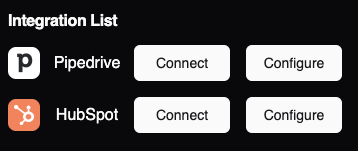
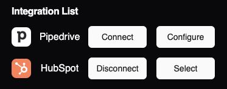
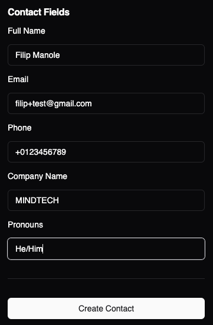
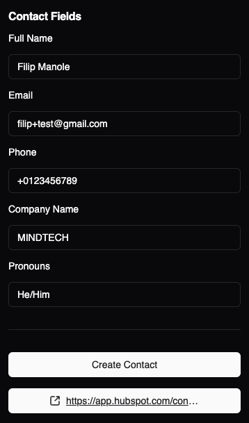

<br />
<p align="center">
  <h1 align="center">Create Contact in HubSpot/Pipedrive</h1>
</p>

## About The Project

React application that leverage Integration.app SDK to connect to HubSpot/Pipedrive CRM to create a contact and retrieve the contact link.

## Prerequisites

Clone this repository:

```sh
git clone https://github.com/filipmanole/integration-app.git
```

## Usage

To start using the project prepare the .env file. You can start from the existing .env.sample:

```sh
cp .env.sample .env
vim .env # edit the file; set the variables properly
```

After placing the environment variables, install the packages:

```sh
npm install
```

Start the application:

```sh
npm run dev
```

## Application is available online

[https://lucent-gumption-ecd7aa.netlify.app/]()

## Demo

1.  Connect to an integration (HubSpot/Pipedrive)
    <br><br>
    

2.  After connecting, select it by clicking "Select"
    <br><br>
    

3.  Fill all fields and create the contact by cliking on "Create Contact"
    <br><br>
    

4.  After creating, a new button will appear that will redirect to the created contact
    <br><br>
    

## Related links

- [https://integration.app/]()
- [https://vite.dev/guide/]()
- [https://tailwindcss.com/]()
